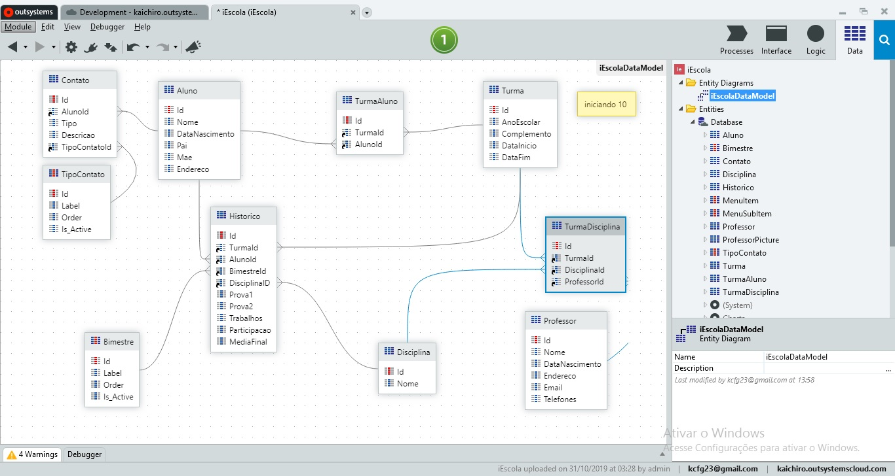
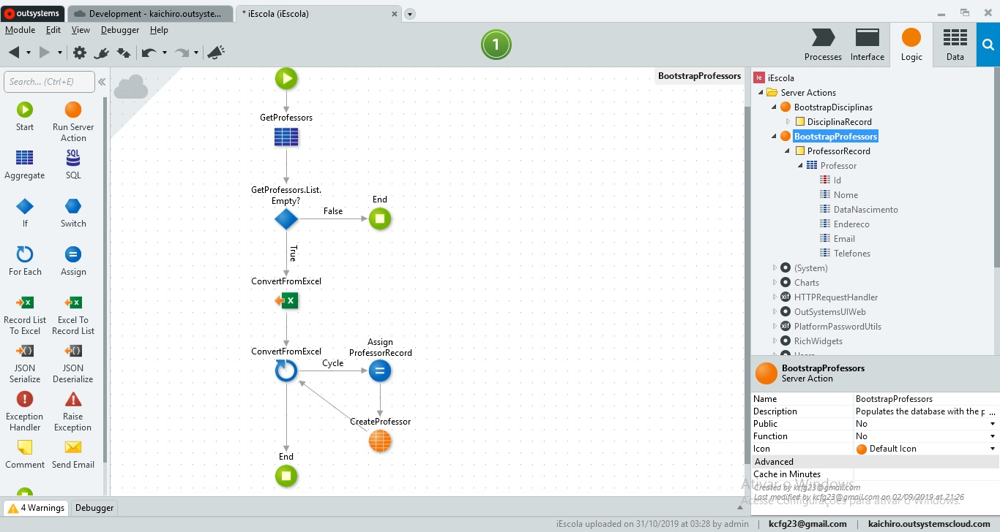
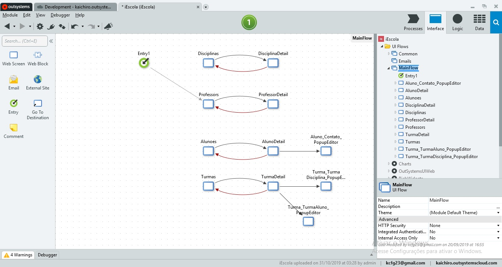

#Academic control (grades, attendance, enrollment, students, subjects and teachers)

My mother is a state school teacher. As an incentive for studying and learning on the OutSystems platform, I saw the possibility of doing something to try and help her better organize this academic information, so I decided to do the requirements gathering and make an application in OutSystems. Still under construction.

---

###### Data

###### Logic

###### Web

